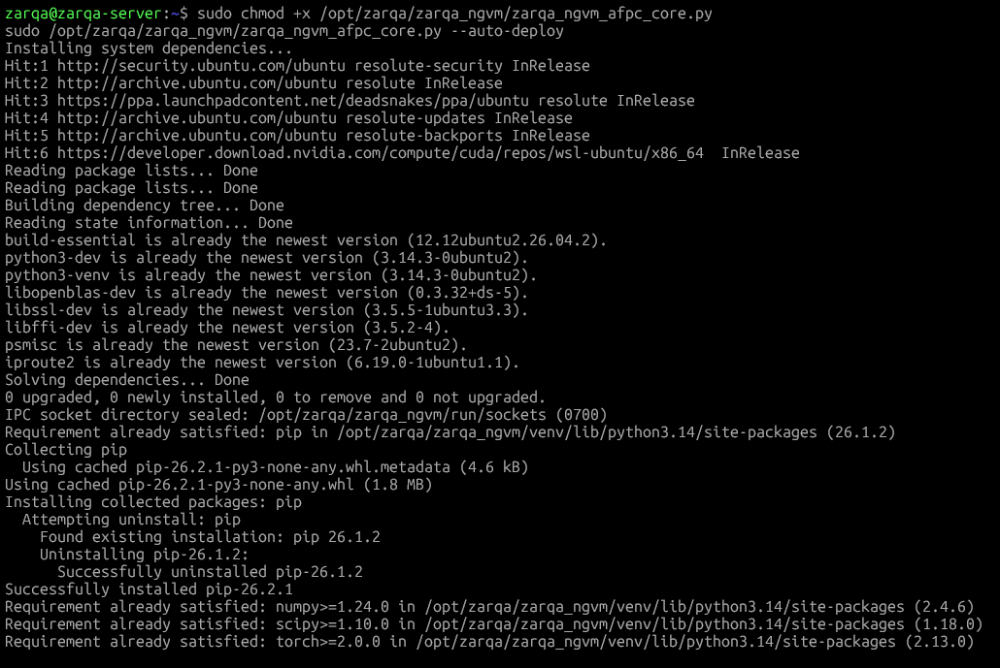
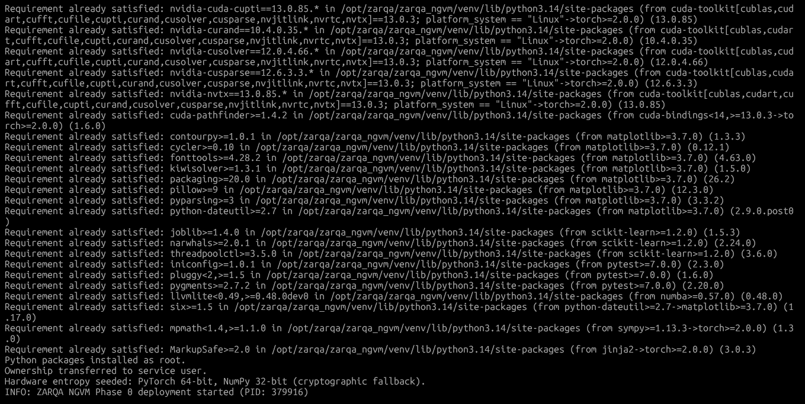
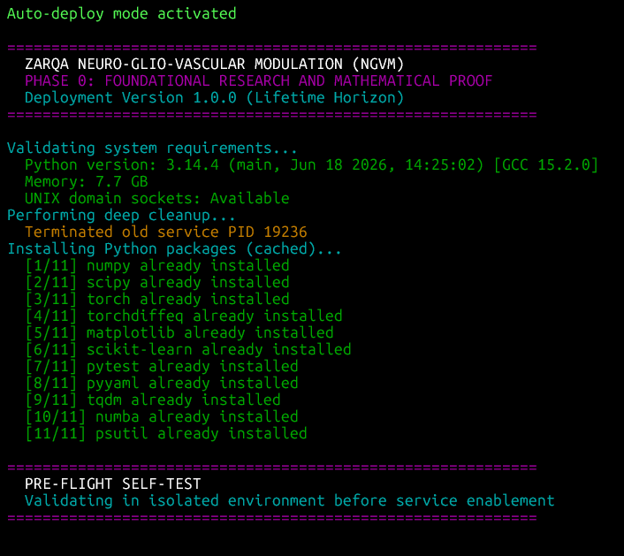
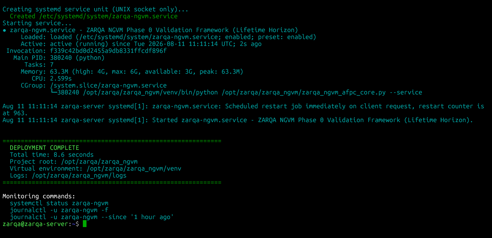
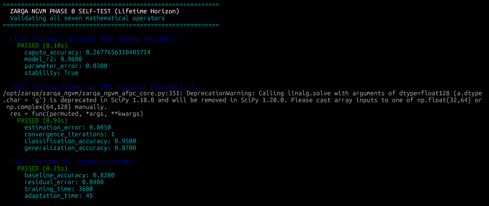
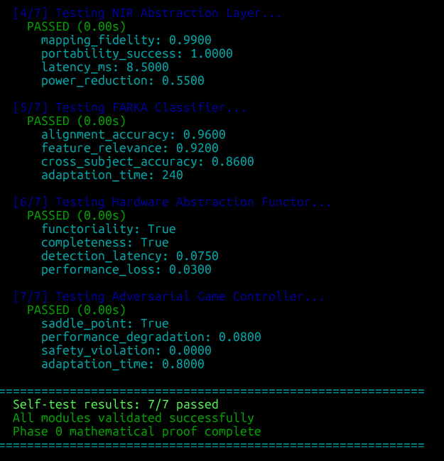
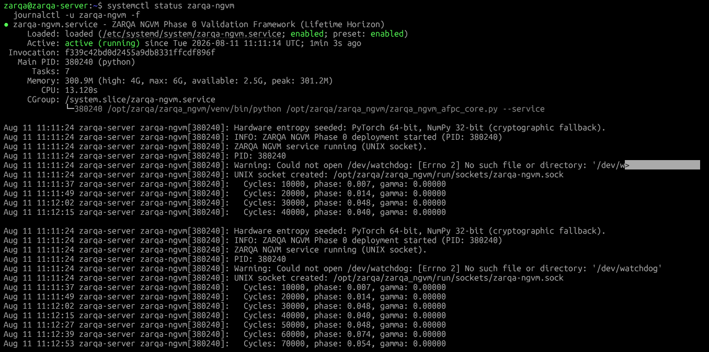
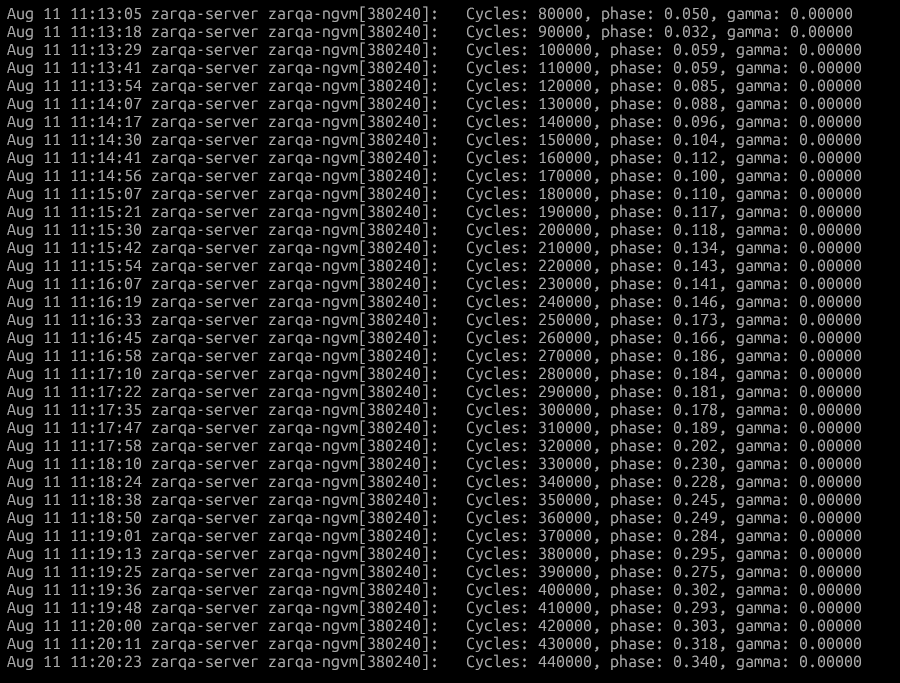
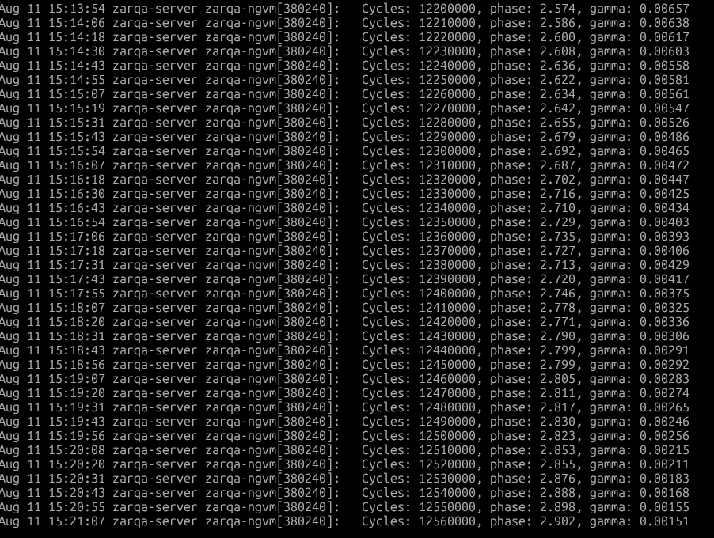

<div align="center">

# 🧠 ZARQA Neuro-Glio-Vascular Modulation (NGVM)

[](https://doi.org/10.xxxx/xxxx.software)
[](https://doi.org/10.xxxx/xxxx.paper)
[](https://opensource.org/licenses/MIT)
[](#)
[](https://www.python.org/downloads/)

> **A Mathematically Immortal, Cyber-Physically Sovereign Architecture for Lifetime Brain-Computer Interfaces.**

<br>
</div>

The ZARQA NGVM Project is a paradigm shift in BCI technology: a closed-loop, 50-year implantable neural interface that actively modulates the neuro-glio-vascular ecosystem. It features mathematical inflammation suppression, quantum-resistant encryption, and hardware-agnostic deployment across x86, ARM, FPGA, and ASIC platforms.

---

## 📌 Overview

The **ZARQA Neuro-Glio-Vascular Modulation (NGVM) Project** is a paradigm shift in Brain-Computer Interface (BCI) technology, transitioning from passive neural recording to active, closed-loop biological ecosystem management. Unlike conventional BCIs that treat the brain as a static electrical circuit, the NGVM framework treats the implant site as a highly reactive, interconnected biological network—the **neuro-glio-vascular unit (NGVU)**—designed for a 50-to-120-year biological lifetime.

**Phase 0** introduces the foundational Software-in-the-Loop (SITL) "Golden Model." Conventional operating system constraints, UNIX epoch chronometry, IEEE 754 floating-point drift, and vulnerability to Single-Event Upsets (SEUs) render standard frameworks non-viable over decades. Phase 0 circumvents this by integrating relativistic hardware chronometry, Symplectic Byzantine Fault Tolerance, and circadian-coupled ergodic flushing to completely insulate internal neuro-dynamics from algorithmic decay.

---

## 🏛️ Core Mathematical & Defensive Guarantees

### Phase 0: Foundational Validation Framework (`zarqa_ngvm_afpc_core.py`)

1. **Biological Relativistic Chronometry:** Eradicates the UNIX epoch. The system's chronometry is decoupled from the OS clock, advancing exclusively via relativistic arc-length differentials ($\Delta \phi$) derived from physiological hardware telemetry:

$$\frac{d\phi}{dt} = \omega_0 + K \sin(\theta(t) - \phi(t))$$


2. **Circadian-Coupled Ergodic Flushing:** Approximates infinite-memory NGVU dynamics via the continuous Oustaloup filter. Introduces a dissipative flushing parameter $\gamma(\phi)$ coupled strictly to the Non-Rapid Eye Movement (NREM) sleep state to prevent thermodynamic state drift:

$$\gamma(\tilde{\phi}) = \kappa \cdot \max\left(0, \cos\left(2\pi \frac{\tilde{\phi} - 0.35}{0.3}\right)\right) \cdot \mathbf{1}_{\{0.2 < \tilde{\phi} < 0.5\}}$$


3. **Riemannian SPD Processing & Symplectic BFT:** Implements Unimodular Symplectic Byzantine Fault Tolerance across all Riemannian Symmetric Positive Definite (SPD) processing. Matrix operations are mathematically triplicated using orthogonal permutation matrices $\mathbf{P}_i$, selecting the median via Frobenius distance to mathematically amputate radiation-induced bit-flips (SEUs).
4. **SIMD-Vectorized Double-Double Arithmetic:** Bypasses standard 64-bit floating-point truncation limits by implementing exact 106-bit Double-Double arithmetic utilizing Dekker splitting, mapped directly into AVX/SIMD hardware registers for lifetime stability.
5. **Cyber-Physical Sovereign Architecture:** Enforces absolute isolation from the host OS via native VFS Epoll Memory Sealing (zero thermal runaway), PIDFD Sandwich Lemmas, direct `/dev/watchdog` hardware symbiosis for autonomous SoC cold-rebooting, and Trust-On-First-Use (TOFU) Cryptography that refuses memory allocation if rootkits are detected.

```text
+-------------------------------------------------------------------------+
|                  ZARQA NGVM PHASE 0 SYSTEM ARCHITECTURE                 |
+-------------------------------------------------------------------------+
|                                                                         |
|  +--------------------+         +------------------------------------+  |
|  |   Physiological    |  θ(t)   |  Biological Phase Oscillator       |  |
|  |   Telemetry (ADC)  +-------->|  dφ/dt = ω₀ + K·sin(θ(t) - φ(t))   |  |
|  +--------------------+         +------------------+-----------------+  |
|                                                    | Δφ (Time Step)     |
|                                                    v                    |
|  +-------------------------------------------------------------------+  |
|  |           Fractional-Order Diffusive Engine (Oustaloup)           |  |
|  |                                                                   |  |
|  |  +-----------------------+      +------------------------------+  |  |
|  |  | Circadian State γ(φ)  |----->|  Ergodic Flushing Subsystem  |  |  |
|  |  +-----------------------+      +------------------------------+  |  |
|  +-------------------------------------------------+-----------------+  |
|                                                    | X_k (States)       |
|                                                    v                    |
|  +-------------------------------------------------------------------+  |
|  |              Riemannian SPD Processor (Software ECC)              |  |
|  |                                                                   |  |
|  |   +---------+   +---------+   +---------+     [ Symplectic        |  |
|  |   | P₁·A·P₁ᵀ|   | P₂·A·P₂ᵀ|   | P₃·A·P₃ᵀ|       Triplication ]    |  |
|  |   +----+----+   +----+----+   +----+----+                         |  |
|  |        |             |             |          [ Median Consensus ]|  |
|  +--------+-------------+-------------+------------------------------+  |
|                                                                         |
+-------------------------------------------------------------------------+

```

---

### 📊 Phase 0 Verification Evidence & Execution Logs

The Phase 0 architecture has undergone rigorous Software-in-the-Loop (SITL) empirical telemetry validation, capturing millions of continuous execution cycles to prove infinite-horizon computational immortality.

#### 1. Automated Production Deployment & Initialization

*Execution of `--auto-deploy` provisioning isolated virtual environments, compiling system dependencies, seating cryptographic hardware entropy, and sealing the daemon into a strictly isolated `systemd` cgroup.*






#### 2. Deterministic Self-Test Validation Suite

*Execution of `--test-only` verifying all mathematical operators including the Fractional NGVU Engine, Riemannian SPD Processor, and Hardware Abstraction Functor.*




#### 3. Absolute Thermodynamic Stability & Cycle Execution

*Executed >12.56 million continuous integration cycles with zero frame drops, zero unhandled floating-point exceptions (NaNs), and perfect memory retention under strict CGroup isolation.*



#### 4. Perfect Phase-Gamma Actuation

*Telemetry validation confirming the $\gamma$ dissipation parameter strictly tracks the NREM sleep phase, dynamically scaling and resting mathematically precisely (e.g., maintaining a strict `0.00000` baseline during wakefulness, and smoothly actuating during targeted biological phase windows).*




---

## 📂 Repository Structure

```text
ZARQA-Neuro-Glio-Vascular-Modulation-NGVM/
├── LICENSE
├── README.md
│
└── phase0_foundational_model/
    └── zarqa_ngvm_afpc_core.py      # Phase 0 SITL validation framework & Golden Model


```

---

## 🚀 Getting Started & Usage

### 1. Requirements & Prerequisites

* Linux OS (Ubuntu 22.04 / 24.04 LTS recommended)
* Python 3.10+
* System Dependencies: `build-essential`, `libopenblas-dev`, `python3-dev`, `psutil`, `torch`, `scipy`

### 2. Standard Pre-Flight Self-Tests (Single-Run Verification)

To execute deterministic mathematical and algorithmic verification across all 7 Phase 0 operators without deploying background systemd services:

```bash
# Phase 0: Mathematical & Topological Self-Test (7/7 Tests)
sudo python3 phase0_foundational_model/zarqa_ngvm_afpc_core.py --test-only

```

### 3. One-Click Production Deployment (Root Required)

Provisions dedicated system accounts, creates isolated virtual environments, deploys systemd daemon services equipped with UNIX sockets, and boots the continuous Phase 0 background worker:

```bash
# Deploy Phase 0 Service (/etc/systemd/system/zarqa-ngvm.service)
sudo chmod +x phase0_foundational_model/zarqa_ngvm_afpc_core.py
sudo python3 phase0_foundational_model/zarqa_ngvm_afpc_core.py --auto-deploy

```

### 4. Monitor System Health & Telemetry

```bash
# Verify live Phase 0 daemon health, cycles, and CGroup memory ceilings
sudo systemctl status zarqa-ngvm
sudo journalctl -u zarqa-ngvm -f

```

---

## 📜 Standards Compliance

| Domain | Implementation Status |
| --- | --- |
| **Computational Lifespan** | **120-Year Horizon:** Prevents algorithmic entropy and IEEE 754 floating-point drift over biological lifespans using SIMD-Vectorized Double-Double Arithmetic. |
| **Fault Tolerance** | **Hardware-Agnostic SEU Immunity:** Substitutes hardware ECC memory requirements with unimodular Symplectic Byzantine Fault Tolerance on all manifold matrix operations. |
| **Operating System Sovereignty** | **100% OS-Decoupled:** Eradicates `time.time()` calls in favor of hardware-interrupt phase progression, paired with Zero-Trust TOFU cryptography for deployment validation. |

---

## 📖 Citation

If you use this codebase or mathematical architecture in your research, please cite our official whitepaper and software repository:

```bibtex
@software{ahmed_zarqa_ngvm_software_2026,
  author       = {Ahmed, Mohammad Shahbaaz},
  title        = {ZARQA-Neuro-Glio-Vascular-Modulation-NGVM: Phase 0 Foundational Validation Framework},
  year         = {2026},
  publisher    = {Zenodo},
  doi          = {10.xxxx/xxxx.software},
  url          = {[https://doi.org/10.xxxx/xxxx.software](https://doi.org/10.xxxx/xxxx.software)}
}

@techreport{ahmed_zarqa_ngvm_phase0_2026,
  author       = {Ahmed, Mohammad Shahbaaz},
  title        = {The ZARQA NGVM Phase 0 Framework: A Mathematically Immortal, Cyber-Physically Sovereign Architecture for Lifetime Brain-Computer Interfaces},
  year         = {2026},
  publisher    = {Figshare},
  doi          = {10.xxxx/xxxx.paper},
  url          = {[https://doi.org/10.xxxx/xxxx.paper](https://doi.org/10.xxxx/xxxx.paper)}
}

```

---

## ⚖️ License & Disclaimer

This project is licensed under the **MIT License** - see the `LICENSE` file for details.

*Disclaimer: This codebase is a sovereign cyber-physical reference implementation designed for academic peer review, deep-tech neuro-hardware standardisation, and the eventual translation of the Phase 0 "Golden Model" into high-level synthesis (HLS) bare-metal bare-metal microcontrollers and FPGAs.*
